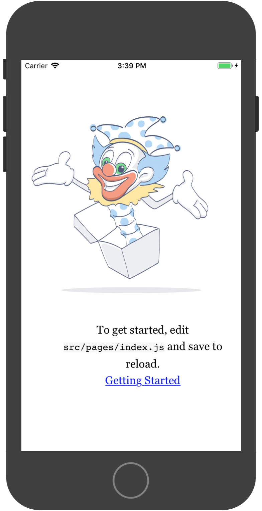

# umi cordova

## 安装环境（Mac）
1.安装XCode
2.安装xcode-select
```sh
$ xcode-select --install
```
弹出软件一直下一步就好。
3.安装ios-deploy
```sh
$ sudo yarn global add ios-deploy
```
4.全局安装Cordova
```sh
$ sudo yarn global add cordova
```
## 新建项目
1.使用cordova初始化项目
```sh
$ cordova create tutorial com.example.tutorial Tutorial
```
2.添加ios平台
```sh
$ cordova platforms add ios
```
## 添加umi项目
1.新建src/pages/index/index.js
```js
import styles from './index.css';

export default function() {
  return (
    <div className={styles.normal}>
      <div className={styles.welcome} />
      <ul className={styles.list}>
        <li>To get started, edit <code>src/pages/index.js</code> and save to reload.</li>
        <li><a href="https://umijs.org/guide/getting-started.html">Getting Started</a></li>
      </ul>
    </div>
  );
}
```
2.新建src/pages/index/index.css
略
3.新建config/config.js
```js
export default {
    outputPath:'www', // build到www目录，cordova会被这个目录拷贝到项目工程
    history: 'hash',
    base: './',
    publicPath:'./' // cordova使用文件协议访问
};
```
4.安装umi
```sh
$ yarn add umi
```
5.添加启动命令package.json
```json
"scripts": {
    "test": "echo \"Error: no test specified\" && exit 1",
    "start": "umi dev",
    "build": "umi build && cordova build ios"
},
```
6.执行编译
```sh
$ npm run build
```
7.使用xcode打开项目 `./platforms/ios/Tutorial.xcworkspace`
选择虚拟机，执行。

8.虚拟机中查看效果

